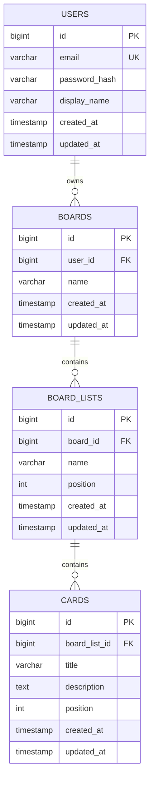

# データベース設計書

関連: [要件定義書](requirements.md) / [機能要件書](functional-requirements.md)

## 0. ER図とは（学習用メモ）

**ER図 (Entity-Relationship Diagram, 実体関連図)** とは、DBの構造を図で表したもの。

### 主な構成要素

| 用語 | 意味 | 例 |
| --- | --- | --- |
| エンティティ (Entity) | テーブルのこと | `users`, `boards`, `cards` |
| 属性 (Attribute) | カラム（列）のこと | `id`, `name`, `created_at` |
| 関係 (Relationship) | テーブル同士のつながり | 「1人のユーザーは複数のボードを持つ」 |
| PK (Primary Key) | 主キー。行を一意に識別する | 通常は `id` |
| FK (Foreign Key) | 外部キー。他テーブルの行を参照する | `boards.user_id` → `users.id` |
| UK (Unique Key) | 一意制約。値の重複不可 | `users.email` |

### 関係（カーディナリティ）の記法

Mermaid の `erDiagram` では以下の記号を使う：

| 記号 | 意味 |
| --- | --- |
| `\|\|--\|\|` | 1対1 |
| `\|\|--o{` | 1対多（左の1に対し右は0以上） |
| `}o--o{` | 多対多 |

本アプリは `users → boards → board_lists → cards` と **親から子へ1対多が連鎖** する構造。

---

## 1. エンティティ一覧

| エンティティ | テーブル名 | 役割 |
| --- | --- | --- |
| ユーザー | `users` | アプリ利用者 |
| ボード | `boards` | ユーザーが持つプロジェクト単位 |
| リスト | `board_lists` | ボード内の列（例: ToDo / Doing / Done） |
| カード | `cards` | リスト内のタスク（1件のToDo） |

### 予約語回避

- `user` は PostgreSQL の予約語、`list` は MySQL の予約語のため、**複数形 or 接頭辞付き** のテーブル名を採用：
  - `user` → `users`
  - `list` → `board_lists`（「ボードに属するリスト」の意）

---

## 2. ER図（Mermaid）

※ GitHub上ではこのコードブロックがそのまま図として描画される。

### 関係の読み方

- **USERS ||--o{ BOARDS**: 1人のユーザーは0個以上のボードを所有
- **BOARDS ||--o{ BOARD_LISTS**: 1つのボードは0個以上のリストを持つ
- **BOARD_LISTS ||--o{ CARDS**: 1つのリストは0個以上のカードを持つ

---

## 3. テーブル定義

### 3.1 users（ユーザー）

| カラム | 型 | NULL | キー | デフォルト | 説明 |
| --- | --- | --- | --- | --- | --- |
| id | BIGINT | NO | PK | AUTO_INCREMENT | ユーザーID |
| email | VARCHAR(255) | NO | UK | - | メールアドレス（ログインID） |
| password_hash | VARCHAR(255) | NO | - | - | ハッシュ化済みパスワード |
| display_name | VARCHAR(100) | YES | - | NULL | 表示名 |
| created_at | TIMESTAMP | NO | - | CURRENT_TIMESTAMP | 作成日時 |
| updated_at | TIMESTAMP | NO | - | CURRENT_TIMESTAMP | 更新日時 |

### 3.2 boards（ボード）

| カラム | 型 | NULL | キー | デフォルト | 説明 |
| --- | --- | --- | --- | --- | --- |
| id | BIGINT | NO | PK | AUTO_INCREMENT | ボードID |
| user_id | BIGINT | NO | FK | - | 所有ユーザーID → users.id |
| name | VARCHAR(50) | NO | - | - | ボード名 |
| created_at | TIMESTAMP | NO | - | CURRENT_TIMESTAMP | 作成日時 |
| updated_at | TIMESTAMP | NO | - | CURRENT_TIMESTAMP | 更新日時 |

### 3.3 board_lists（リスト）

| カラム | 型 | NULL | キー | デフォルト | 説明 |
| --- | --- | --- | --- | --- | --- |
| id | BIGINT | NO | PK | AUTO_INCREMENT | リストID |
| board_id | BIGINT | NO | FK | - | 所属ボードID → boards.id |
| name | VARCHAR(50) | NO | - | - | リスト名（例: ToDo） |
| position | INT | NO | - | 0 | ボード内での表示順 |
| created_at | TIMESTAMP | NO | - | CURRENT_TIMESTAMP | 作成日時 |
| updated_at | TIMESTAMP | NO | - | CURRENT_TIMESTAMP | 更新日時 |

### 3.4 cards（カード）

| カラム | 型 | NULL | キー | デフォルト | 説明 |
| --- | --- | --- | --- | --- | --- |
| id | BIGINT | NO | PK | AUTO_INCREMENT | カードID |
| board_list_id | BIGINT | NO | FK | - | 所属リストID → board_lists.id |
| title | VARCHAR(255) | NO | - | - | カードタイトル |
| description | TEXT | YES | - | NULL | 説明（任意機能） |
| position | INT | NO | - | 0 | リスト内での表示順 |
| created_at | TIMESTAMP | NO | - | CURRENT_TIMESTAMP | 作成日時 |
| updated_at | TIMESTAMP | NO | - | CURRENT_TIMESTAMP | 更新日時 |

---

## 4. インデックス

検索性能のため以下のインデックスを設定する。

| テーブル | インデックス名 | カラム | 種別 | 目的 |
| --- | --- | --- | --- | --- |
| users | uk_users_email | email | UNIQUE | ログイン時の検索高速化 + 一意性担保 |
| boards | idx_boards_user_id | user_id | 通常 | 「自分のボード一覧」取得を高速化 |
| board_lists | idx_board_lists_board_id | board_id | 通常 | ボード内リスト取得を高速化 |
| board_lists | idx_board_lists_board_pos | (board_id, position) | 複合 | 順序付き一覧取得を高速化 |
| cards | idx_cards_list_id | board_list_id | 通常 | リスト内カード取得を高速化 |
| cards | idx_cards_list_pos | (board_list_id, position) | 複合 | 順序付きカード取得を高速化 |

---

## 5. 制約

### 5.1 NOT NULL 制約

上記テーブル定義の「NULL: NO」列参照。

### 5.2 UNIQUE 制約

- `users.email` — 同じメールアドレスでの重複登録を防ぐ

### 5.3 外部キー制約（ON DELETE CASCADE）

親レコード削除時に子レコードも一緒に削除する設定。

| 子テーブル | 子カラム | 親テーブル | 親カラム | ON DELETE |
| --- | --- | --- | --- | --- |
| boards | user_id | users | id | CASCADE |
| board_lists | board_id | boards | id | CASCADE |
| cards | board_list_id | board_lists | id | CASCADE |

**カスケード削除の意味**: 例えば `users` の1行を削除すると、その人の `boards` → 配下の `board_lists` → 配下の `cards` まで全て自動削除される。「孤児データ」が残るのを防ぐ。

### 5.4 CHECK 制約（任意）

- `board_lists.position >= 0`
- `cards.position >= 0`

※ MySQL 8.0+, PostgreSQL で有効。古いMySQLではサポートされない。

---

## 6. 今後の拡張余地（MVP外）

任意機能（[機能要件書](functional-requirements.md) 参照）を追加する場合のテーブル候補：

| 機能 | 追加テーブル案 |
| --- | --- |
| カード詳細（期限・ラベル） | `cards` に `due_date` カラム追加、`labels` と `card_labels`（多対多）を追加 |
| コメント | `card_comments`（card_id, user_id, body, created_at） |
| ボード共有 | `board_members`（board_id, user_id, role） ※ boards.user_id は所有者として残す |

本MVPではこれらは実装せず、**スキーマ変更はマイグレーションで後から足せる** 形にしておく。

---

## 7. 次のステップ

1. 技術スタック確定後、本設計を元に `schema.sql`（DDL）を作成
2. JPA Entity クラスへのマッピング
3. Repository / Service 実装
