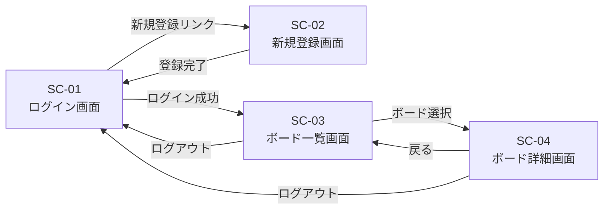

# 画面設計書

関連: [要件定義書](requirements.md) / [機能要件書](functional-requirements.md)

## 1. 画面一覧

| 画面ID | 画面名 | 概要 | 関連機能 |
| --- | --- | --- | --- |
| SC-01 | ログイン画面 | メール・パスワードでログイン | F-02 |
| SC-02 | 新規登録画面 | ユーザー登録フォーム | F-01 |
| SC-03 | ボード一覧画面 | 自分のボードを一覧表示、新規作成 | F-03, F-04, F-05 |
| SC-04 | ボード詳細画面 | リストとカードを並べて操作 | F-06 〜 F-10 |

---

## 2. 画面遷移図



---

## 3. ワイヤーフレーム（簡易）

### SC-01 ログイン画面

```text
┌────────────────────────────────┐
│         Task Management        │
├────────────────────────────────┤
│  Email    : [____________]     │
│  Password : [____________]     │
│            [  ログイン  ]      │
│                                │
│   新規登録はこちら →           │
└────────────────────────────────┘
```

### SC-02 新規登録画面

```text
┌────────────────────────────────┐
│         新規ユーザー登録       │
├────────────────────────────────┤
│  表示名   : [____________]     │
│  Email    : [____________]     │
│  Password : [____________]     │
│            [   登録   ]        │
│                                │
│   ログイン画面へ戻る →         │
└────────────────────────────────┘
```

### SC-03 ボード一覧画面

```text
┌──────────────────────────────────────┐
│ Task Management   [ + 新規ボード ]   │
├──────────────────────────────────────┤
│  ┌──────┐ ┌──────┐ ┌──────┐          │
│  │Board1│ │Board2│ │Board3│          │
│  └──────┘ └──────┘ └──────┘          │
└──────────────────────────────────────┘
```

### SC-04 ボード詳細画面

```text
┌───────────────────────────────────────────────┐
│ ← 戻る   Board1                               │
├───────────────────────────────────────────────┤
│ ┌────────┐ ┌────────┐ ┌────────┐              │
│ │ ToDo   │ │ Doing  │ │ Done   │   + リスト   │
│ ├────────┤ ├────────┤ ├────────┤              │
│ │ Card A │ │ Card C │ │ Card E │              │
│ │ Card B │ │ Card D │ │        │              │
│ │ +カード │ │ +カード │ │ +カード │             │
│ └────────┘ └────────┘ └────────┘              │
└───────────────────────────────────────────────┘
```

---

## 4. 画面要件

### SC-01 要件（ログイン画面）

| 項目 | 要件 |
| --- | --- |
| 表示項目 | タイトル、メール入力、パスワード入力、ログインボタン、新規登録リンク |
| 入力バリデーション | 必須入力チェック／メール形式チェック |
| エラー表示 | 認証失敗時にフォーム下部にメッセージ表示 |
| 遷移 | 成功→SC-03／新規登録リンク→SC-02 |

### SC-02 要件（新規登録画面）

| 項目 | 要件 |
| --- | --- |
| 表示項目 | 表示名、メール、パスワード、登録ボタン、戻るリンク |
| 入力バリデーション | メール形式・一意性／パスワード8文字以上 |
| エラー表示 | 項目ごとにエラーメッセージを表示 |
| 遷移 | 成功→SC-01／戻る→SC-01 |

### SC-03 要件（ボード一覧画面）

| 項目 | 要件 |
| --- | --- |
| 表示項目 | ボードカード一覧、新規ボード作成ボタン、ログアウトボタン |
| 表示対象 | ログインユーザーが所有するボードのみ |
| 操作 | ボード選択→SC-04／削除・名称変更／新規作成 |
| ソート | 作成日時の降順（新しいものが上） |

### SC-04 要件（ボード詳細画面）

| 項目 | 要件 |
| --- | --- |
| 表示項目 | リスト群（横並び）、各リスト配下のカード、リスト追加ボタン |
| 操作 | カードの作成・編集・削除／ドラッグ&ドロップでリスト内・リスト間の移動／リストの並び替え |
| レイアウト | 横スクロール可。リストは縦に伸びる |
| リアルタイム性 | 自分の操作のみ即時反映（他ユーザーとの同期は対象外） |
